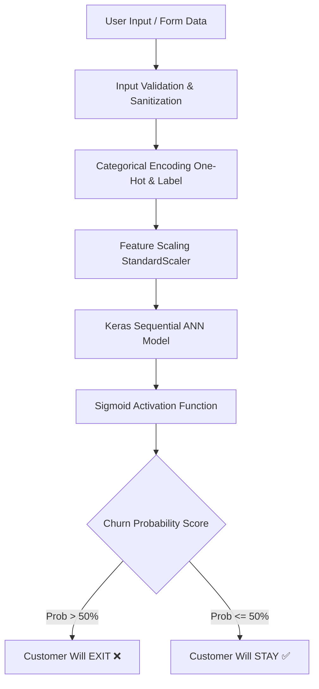

<div align="center">

# 📊 Customer Churn Probability Predictor

**An end-to-end Machine Learning web application leveraging Artificial Neural Networks (ANN) and Flask to predict bank customer retention and churn risk in real-time.**

[](https://www.python.org/)
[](https://www.tensorflow.org/)
[](https://flask.palletsprojects.com/)
[](https://scikit-learn.org/)
[](LICENSE)

</div>

---

## 📌 Overview

Customer churn is one of the most critical metrics for financial institutions and subscription businesses. This project provides a complete, production-ready solution to predict whether a bank customer will churn (**Exit**) or stay with the bank (**Stay**).

Powered by a multi-layer **Artificial Neural Network (ANN)** built with Keras/TensorFlow, the system processes demographic, financial, and behavioral attributes to yield an accurate churn probability score alongside actionable prediction outcomes.

---

## ✨ Key Features

- 🧠 **Deep Learning Architecture**: Built using a multi-layer Sequential ANN optimized with the Adam optimizer and Binary Cross-Entropy loss.
- ⚡ **Real-Time Web Inference**: Fast Flask web backend supporting instantaneous evaluation of customer profiles.
- 🛡️ **Robust Server-Side Validation**: Sanitizes and validates user input ranges (e.g., Credit Score 300–850, Age 18–100, Balance checks) to ensure model safety.
- 🔄 **Standardized Feature Pipeline**: One-Hot Encoding for categorical regions (`France`, `Spain`, `Germany`), Label Encoding for gender, and Z-score Feature Scaling with `StandardScaler`.
- 💻 **Dual Execution Modes**: Interactive Web Dashboard (`app.py`) for end users and CLI Pipeline (`main.py`) for dataset training, evaluation, and serialized artifact generation.

---

## 🏗️ System Architecture



---

## 📊 Dataset & Feature Dictionary

The model is trained on the classic **Bank Customer Churn Dataset** (`Churn_Modelling.csv`), containing demographic and account information for 10,000 customers.

| Feature Name | Type | Description | Range / Values |
| :--- | :--- | :--- | :--- |
| `CreditScore` | Integer | Customer's credit score | 300 – 850 |
| `Geography` | Categorical | Country of residence | France, Spain, Germany |
| `Gender` | Categorical | Gender of customer | Male, Female |
| `Age` | Integer | Customer age | 18 – 100 |
| `Tenure` | Integer | Years as a bank customer | 0 – 10 years |
| `Balance` | Float | Account balance | $\ge$ 0.00 |
| `NumOfProducts` | Integer | Number of bank products held | 1 – 4 |
| `HasCrCard` | Binary | Possesses credit card | 0 = No, 1 = Yes |
| `IsActiveMember` | Binary | Active membership status | 0 = No, 1 = Yes |
| `EstimatedSalary` | Float | Estimated annual salary | $\ge$ 0.00 |
| **`Exited` (Target)** | Binary | Churn outcome | 0 = Stayed, 1 = Exited |

---

## 🤖 Neural Network Specifications

- **Input Layer**: 11 Transformed Features (3 One-Hot Geo + 8 Scaled Numerical/Categorical)
- **Hidden Layer 1**: 6 Neurons, `ReLU` Activation
- **Hidden Layer 2**: 6 Neurons, `ReLU` Activation
- **Output Layer**: 1 Neuron, `Sigmoid` Activation (Outputs probability $P \in [0, 1]$)
- **Optimizer**: `Adam`
- **Loss Function**: `binary_crossentropy`
- **Epochs**: 20 (Batch Size: 32)

---

## 📁 Repository Structure

```text
PE2 Project/
├── templates/
│   ├── index.html        # Glassmorphic web frontend UI
│   └── style.css         # Styling stylesheet
├── app.py                # Flask server application & API routes
├── main.py               # ML Pipeline: Training, evaluation & artifact serialization
├── Churn_Modelling.csv   # Bank Customer Churn dataset
├── churn_model.h5        # Serialized Keras ANN model artifact
├── scaler.pkl            # Serialized StandardScaler object
├── encoder.pkl           # Serialized ColumnTransformer/Encoder object
├── requirements.txt      # Python dependencies list
└── README.md             # Project documentation
```

---

## 🚀 Quick Start Guide

### 1. Prerequisites
Ensure you have Python **3.9+** installed on your system.

### 2. Clone Repository & Setup Environment
```bash
# Clone the repository
git clone https://github.com/Krish2600/churn-probability-predictor.git
cd churn-probability-predictor

# Create virtual environment
python -m venv venv

# Activate virtual environment
# Windows (PowerShell):
.\venv\Scripts\Activate.ps1
# macOS / Linux:
source venv/bin/activate
```

### 3. Install Dependencies
```bash
pip install -r requirements.txt
```

### 4. Train the Model (Optional)
To retrain the ANN model on the dataset and regenerate `.h5` and `.pkl` artifacts:
```bash
python main.py
```

### 5. Launch the Web Application
```bash
python app.py
```
Open your browser and navigate to **`http://127.0.0.1:5000/`**.

---

## 🌐 Web Application Usage

1. Open the web interface at `http://127.0.0.1:5000/`.
2. Fill in the customer metrics:
   - **Credit Score**: e.g., `650`
   - **Geography**: Select `France`, `Spain`, or `Germany`
   - **Gender**: Select `Male` or `Female`
   - **Age**: e.g., `42`
   - **Tenure**: e.g., `5` years
   - **Balance**: e.g., `75000.00`
   - **Number of Products**: `1` to `4`
   - **Has Credit Card**: `1` (Yes) or `0` (No)
   - **Active Member**: `1` (Yes) or `0` (No)
   - **Estimated Salary**: e.g., `50000.00`
3. Click **Predict Churn Risk**.
4. The system calculates the risk score and displays the retention outcome:
   - 🔴 **Customer will EXIT ❌** (Probability > 50%)
   - 🟢 **Customer will STAY ✅** (Probability $\le$ 50%)

---

## 🛠️ API & Endpoints

| HTTP Method | Route | Description |
| :--- | :--- | :--- |
| `GET` | `/` | Renders the main prediction input dashboard |
| `POST` | `/predict` | Validates input parameters, scales features, and returns churn risk prediction |

---

## 🤝 Contributing

Contributions, issues, and feature requests are welcome! Feel free to check the issues page.

1. Fork the Project
2. Create your Feature Branch (`git checkout -b feature/AmazingFeature`)
3. Commit your Changes (`git commit -m 'Add some AmazingFeature'`)
4. Push to the Branch (`git checkout -b feature/AmazingFeature`)
5. Open a Pull Request

---

## 📜 License

Distributed under the **MIT License**. See `LICENSE` for more details.