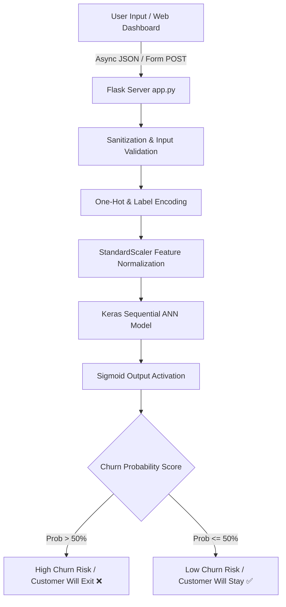

<div align="center">

# 📊 Customer Churn Probability Predictor

**An end-to-end Machine Learning web application leveraging Artificial Neural Networks (ANN) and Flask with a modern Glassmorphism dashboard to predict bank customer retention and churn risk in real-time.**

[](https://churnpredict-5lq5.onrender.com)
[](https://www.python.org/)
[](https://www.tensorflow.org/)
[](https://flask.palletsprojects.com/)
[](https://scikit-learn.org/)
[](https://render.com)
[](LICENSE)

</div>

---

## 📌 Overview

Customer churn is a critical metric for financial institutions. This project provides a complete, production-grade solution to predict whether a bank customer will churn (**Exit**) or stay (**Stay**).

Powered by a multi-layer **Artificial Neural Network (ANN)** built with Keras/TensorFlow, the system processes demographic, financial, and behavioral attributes to yield real-time churn probability scores displayed on an interactive **Glassmorphic Web Dashboard**.

---

## ✨ Key Features

- 🧠 **Deep Learning Architecture**: Multi-layer Sequential ANN optimized with Adam optimizer and Binary Cross-Entropy loss.
- 🎨 **Luxury Glassmorphism Dashboard**: Deep slate dark theme, SVG radial risk gauge meter, dynamic percentage count-up, and color-coded risk level badges (Low, Moderate, High).
- ⚡ **1-Click Quick Presets**: Test preset customer profiles ("High Risk Sample", "Loyal Customer", "Moderate Risk") instantly with one click.
- 🔄 **Async REST API & Modern UX**: Asynchronous predictions via `/api/predict` without page reloads, paired with standard HTML form POST fallback.
- 🎛️ **Interactive Toggle Switches**: Replaces raw `0`/`1` inputs for binary attributes (*Has Credit Card*, *Is Active Member*) with smooth toggle switches.
- 🚀 **Cloud Deployment Ready**: Built-in production WSGI support (`gunicorn`), `Procfile`, `render.yaml`, `Dockerfile`, `.slugignore`, and `/health` monitor.

---

## 🏗️ System Architecture



---

## 📊 Feature Dictionary

| Feature Name | Type | Description | Range / Values |
| :--- | :--- | :--- | :--- |
| `CreditScore` | Integer | Customer's credit score | 300 – 850 |
| `Geography` | Categorical | Country of residence | France, Spain, Germany |
| `Gender` | Categorical | Gender of customer | Male, Female |
| `Age` | Integer | Customer age | 18 – 100 years |
| `Tenure` | Integer | Years as a bank customer | 0 – 10 years |
| `Balance` | Float | Account balance | $\ge$ $0.00 |
| `NumOfProducts` | Integer | Number of bank products held | 1 – 4 |
| `HasCrCard` | Binary | Possesses credit card | Toggle Switch (0 = No, 1 = Yes) |
| `IsActiveMember` | Binary | Active membership status | Toggle Switch (0 = No, 1 = Yes) |
| `EstimatedSalary` | Float | Estimated annual salary | $\ge$ $0.00 |
| **`Exited` (Target)** | Binary | Churn outcome | 0 = Stayed, 1 = Exited |

---

## 📁 Repository Structure

```text
PE2 Project/
├── static/
│   ├── css/
│   │   └── style.css       # Luxury glassmorphism design system
│   └── js/
│       └── main.js         # Async AJAX, gauge animations & profile presets
├── templates/
│   └── index.html          # Interactive Glassmorphic Web Dashboard
├── app.py                  # Flask Web backend, REST API & health routes
├── main.py                 # ML Pipeline: Model training & artifact generation
├── Churn_Modelling.csv     # Bank Customer Churn dataset
├── churn_model.h5          # Serialized Keras ANN model artifact
├── scaler.pkl              # Serialized StandardScaler object
├── encoder.pkl             # Serialized OneHot/Label Encoder object
├── requirements.txt        # Dependencies list (Flask, TensorFlow, Gunicorn)
├── Procfile                # Heroku / Railway / Render WSGI start command
├── render.yaml             # Render 1-click deployment configuration
├── Dockerfile              # Containerization specification
├── .dockerignore           # Excluded files for Docker build
├── .slugignore             # Excluded files for lightweight cloud deployment
└── README.md               # Project documentation
```

---

## 🚀 Quick Start Guide

### 1. Prerequisites
Python **3.10+** installed.

### 2. Clone Repository & Setup Virtual Environment
```bash
git clone https://github.com/Krish2600/churn-probability-predictor.git
cd churn-probability-predictor

python -m venv venv

# Windows (PowerShell):
.\venv\Scripts\Activate.ps1
# macOS / Linux:
source venv/bin/activate
```

### 3. Install Dependencies
```bash
pip install -r requirements.txt
```

### 4. Launch Development Server
```bash
python app.py
```
Open **`http://127.0.0.1:5000`** in your browser.

---

## 🌐 Production Deployment Guide

### Option 1: Deploy on Render
1. Push code to your GitHub repository.
2. Log into [Render.com](https://render.com) and click **New + -> Web Service**.
3. Connect your repository.
4. Select **Environment: Python** and set:
   - **Build Command**: `pip install -r requirements.txt`
   - **Start Command**: `gunicorn app:app`
5. Click **Create Web Service**.

### Option 2: Deploy with Docker
```bash
# Build Docker image
docker build -t churn-predictor:latest .

# Run container on port 5000
docker run -d -p 5000:5000 churn-predictor:latest
```

---

## 🛠️ API Reference

### Health Check Endpoint
```http
GET /health
```
**Response (200 OK)**:
```json
{
  "status": "ok",
  "model_loaded": true,
  "scaler_loaded": true
}
```

### Churn Risk Prediction Endpoint
```http
POST /api/predict
Content-Type: application/x-www-form-urlencoded
```
**Body Parameters**:
`credit_score`, `geography`, `gender`, `age`, `tenure`, `balance`, `num_products`, `has_card`, `is_active`, `salary`

**Response (200 OK)**:
```json
{
  "success": true,
  "probability": 72.4,
  "prediction_text": "Customer will EXIT ❌",
  "will_exit": true
}
```

---

## 📜 License

Distributed under the **MIT License**.
